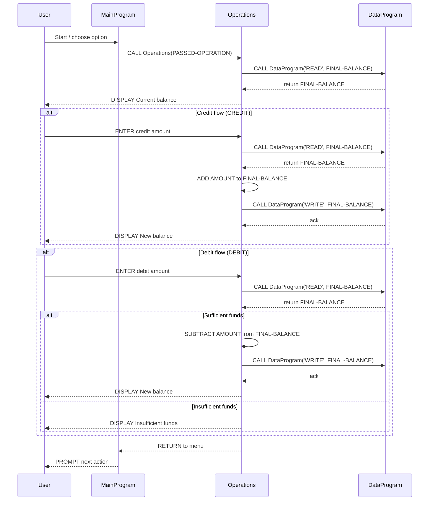

# Legacy COBOL Student Account System

This document explains the purpose of each COBOL source file in `src/cobol/`, outlines their key variables and routines, and records the business rules that govern student account operations.

## Overview

- Purpose: Simple in-memory account management (view balance, credit, debit) implemented across three programs that call each other: `MainProgram` (menu/flow), `Operations` (user operations), and `DataProgram` (simple storage accessor).
- Scope: Designed for single-user, in-memory operation (no database or file persistence). This is a modernization starting point.

## Files and purposes

- `src/cobol/main.cob` — Entry point and user menu.
  - Key symbols: `USER-CHOICE`, `CONTINUE-FLAG`, paragraph `MAIN-LOGIC`.
  - Responsibilities: Display menu, read user choice (1-4), call `Operations` with the operation token.

- `src/cobol/operations.cob` — Implements the account operations triggered by the menu.
  - Key symbols: `OPERATION-TYPE`, `AMOUNT`, `FINAL-BALANCE`, linkage `PASSED-OPERATION`.
  - Responsibilities: Interpret passed operation token (`'TOTAL '`, `'CREDIT'`, `'DEBIT '`), prompt for amounts (credit/debit), call `DataProgram` to read/write balances, and display results.

- `src/cobol/data.cob` — Simple data accessor that holds the account balance in working-storage.
  - Key symbols: `STORAGE-BALANCE`, linkage `PASSED-OPERATION`, `BALANCE`.
  - Responsibilities: On `READ` move `STORAGE-BALANCE` to the caller's `BALANCE`; on `WRITE` move caller `BALANCE` into `STORAGE-BALANCE`.

## Key routines & how they interact

- `MainProgram.MAIN-LOGIC` — loops until user exits; maps numeric choices to operation tokens and calls `Operations`.
- `Operations` (Procedure Division USING `PASSED-OPERATION`) — moves `PASSED-OPERATION` into `OPERATION-TYPE` and branches:
  - `TOTAL` / `READ`: Calls `DataProgram` with `'READ'` to fetch `FINAL-BALANCE` and displays it.
  - `CREDIT`: Prompts for credit amount, reads current balance, adds amount, writes back via `DataProgram` with `'WRITE'`.
  - `DEBIT`: Prompts for debit amount, reads current balance, checks funds, subtracts if sufficient, writes back; otherwise displays insufficient funds.
- `DataProgram` (Procedure Division USING `PASSED-OPERATION BALANCE`) — central in-memory storage for the balance. Acts as the single source of truth while the program runs.

## Business rules for student accounts

1. Initial balance: `STORAGE-BALANCE` is initialized to `1000.00`.
2. Currency/precision: Balances and amounts use `PIC 9(6)V99` (two decimal places). Maximum representable balance is `999,999.99`.
3. Credits: A credit amount is added to the current balance and the updated balance is stored.
4. Debits: A debit is allowed only if `FINAL-BALANCE >= AMOUNT`. If insufficient, the debit is rejected and no write occurs.
5. Input validation: There is no explicit numeric validation beyond COBOL picture fields and user input via `ACCEPT`. Non-numeric input may cause unexpected behavior — validate/parse input before arithmetic in modernization.
6. Operation tokens: Operation identifiers are fixed-width strings (`'TOTAL '`, `'CREDIT'`, `'DEBIT '`, `'READ'`, `'WRITE'`). Calls must use the exact values (including spaces) used in the code.
7. Concurrency: The system is single-process and holds balance in working-storage; there is no concurrency control or persistence. Multiple simultaneous users are not supported.

## Implementation notes & modernization suggestions

- Persistence: Add a file or database layer to persist `STORAGE-BALANCE` between runs.
- Validation: Add input parsing and validation for amounts (positive numbers, max/min limits).
- Currency handling: Consider using integer cents (avoid floating representation) or a decimal library for precise money math.
- Error handling: Currently prints messages to console; add structured error codes and logging.
- Token robustness: Replace fixed-width tokens with enumerated values or numeric codes to avoid trailing-space bugs.

## Where to look in the code

- Menu and flow: `src/cobol/main.cob`
- Operation logic (credit/debit/total): `src/cobol/operations.cob`
- Balance storage/access: `src/cobol/data.cob`

---
For questions or if you want, I can: add input validation, implement file persistence for balances, or convert the system to a single modern program with modular procedures.

## Sequence Diagram

Below is a Mermaid sequence diagram showing the data flow between the user, `MainProgram`, `Operations`, and `DataProgram` during typical flows (view, credit, debit).

